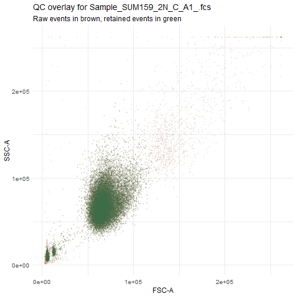
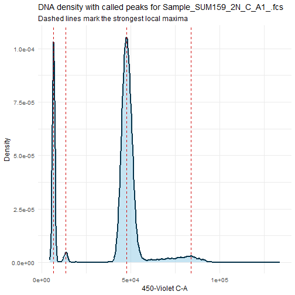
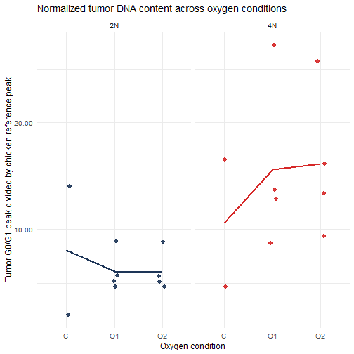
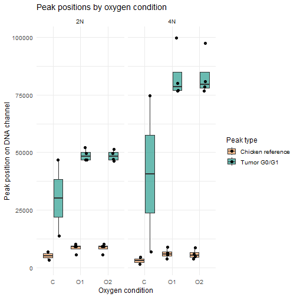

# Workflow Goal

This document turns the raw `.fcs` files into a first-pass set of quality-controlled
DNA-content summaries. The immediate objective is to identify the internal chicken
reference peak and the tumor G0/G1 peak in each sample, summarize their relative
positions, and test whether oxygen condition shifts the normalized DNA-content signal.

# Input Configuration

# Sample Metadata Parsing

Table: Parsed sample metadata from FCS filenames.

|file_name                   |sample_id        |cell_line |starting_ploidy |oxygen_condition |replicate_id |
|:---------------------------|:----------------|:---------|:---------------|:----------------|:------------|
|Sample_SUM159_2N_C_A1_.fcs  |SUM159_2N_C_A1_  |SUM159    |2N              |C                |A1           |
|Sample_SUM159_2N_C_A12.fcs  |SUM159_2N_C_A12  |SUM159    |2N              |C                |A12          |
|Sample_SUM159_2N_O1_A12.fcs |SUM159_2N_O1_A12 |SUM159    |2N              |O1               |A12          |
|Sample_SUM159_2N_O1_A18.fcs |SUM159_2N_O1_A18 |SUM159    |2N              |O1               |A18          |
|Sample_SUM159_2N_O1_A23.fcs |SUM159_2N_O1_A23 |SUM159    |2N              |O1               |A23          |
|Sample_SUM159_2N_O1_A6.fcs  |SUM159_2N_O1_A6  |SUM159    |2N              |O1               |A6           |
|Sample_SUM159_2N_O2_A12.fcs |SUM159_2N_O2_A12 |SUM159    |2N              |O2               |A12          |
|Sample_SUM159_2N_O2_A18.fcs |SUM159_2N_O2_A18 |SUM159    |2N              |O2               |A18          |
|Sample_SUM159_2N_O2_A23.fcs |SUM159_2N_O2_A23 |SUM159    |2N              |O2               |A23          |
|Sample_SUM159_2N_O2_A6.fcs  |SUM159_2N_O2_A6  |SUM159    |2N              |O2               |A6           |
|Sample_SUM159_4N_C_A1_.fcs  |SUM159_4N_C_A1_  |SUM159    |4N              |C                |A1           |
|Sample_SUM159_4N_C_A12.fcs  |SUM159_4N_C_A12  |SUM159    |4N              |C                |A12          |
|Sample_SUM159_4N_O1_A12.fcs |SUM159_4N_O1_A12 |SUM159    |4N              |O1               |A12          |
|Sample_SUM159_4N_O1_A19.fcs |SUM159_4N_O1_A19 |SUM159    |4N              |O1               |A19          |
|Sample_SUM159_4N_O1_A22.fcs |SUM159_4N_O1_A22 |SUM159    |4N              |O1               |A22          |
|Sample_SUM159_4N_O1_A6.fcs  |SUM159_4N_O1_A6  |SUM159    |4N              |O1               |A6           |
|Sample_SUM159_4N_O2_A12.fcs |SUM159_4N_O2_A12 |SUM159    |4N              |O2               |A12          |
|Sample_SUM159_4N_O2_A19.fcs |SUM159_4N_O2_A19 |SUM159    |4N              |O2               |A19          |
|Sample_SUM159_4N_O2_A22.fcs |SUM159_4N_O2_A22 |SUM159    |4N              |O2               |A22          |
|Sample_SUM159_4N_O2_A6.fcs  |SUM159_4N_O2_A6  |SUM159    |4N              |O2               |A6           |

# Flow Import and Quality Control

Table: Event counts before and after a conservative exploratory QC gate.

|file_name                   | events_raw| events_qc| qc_retention|
|:---------------------------|----------:|---------:|------------:|
|Sample_SUM159_2N_C_A1_.fcs  |      27997|     24810|        0.886|
|Sample_SUM159_2N_C_A12.fcs  |      31009|     27451|        0.885|
|Sample_SUM159_2N_O1_A12.fcs |      31225|     27726|        0.888|
|Sample_SUM159_2N_O1_A18.fcs |      25309|     22496|        0.889|
|Sample_SUM159_2N_O1_A23.fcs |      33760|     29957|        0.887|
|Sample_SUM159_2N_O1_A6.fcs  |      40327|     35732|        0.886|
|Sample_SUM159_2N_O2_A12.fcs |      29454|     26138|        0.887|
|Sample_SUM159_2N_O2_A18.fcs |      25812|     22913|        0.888|
|Sample_SUM159_2N_O2_A23.fcs |      37255|     33091|        0.888|
|Sample_SUM159_2N_O2_A6.fcs  |      41590|     36837|        0.886|
|Sample_SUM159_4N_C_A1_.fcs  |      27702|     24543|        0.886|
|Sample_SUM159_4N_C_A12.fcs  |      30218|     26719|        0.884|
|Sample_SUM159_4N_O1_A12.fcs |      25792|     22899|        0.888|
|Sample_SUM159_4N_O1_A19.fcs |      31521|     27976|        0.888|
|Sample_SUM159_4N_O1_A22.fcs |      33497|     29667|        0.886|
|Sample_SUM159_4N_O1_A6.fcs  |      61570|     54505|        0.885|
|Sample_SUM159_4N_O2_A12.fcs |      25365|     22556|        0.889|
|Sample_SUM159_4N_O2_A19.fcs |      28172|     25061|        0.890|
|Sample_SUM159_4N_O2_A22.fcs |      33905|     30045|        0.886|
|Sample_SUM159_4N_O2_A6.fcs  |      47824|     42357|        0.886|

# Quality-Control Visualizations

plot of chunk qc-example-plot

# Peak Detection on DNA Channel

Table: Per-sample DNA peak summary after QC filtering and heuristic density-peak calling.

|file_name                   |sample_id        |cell_line |starting_ploidy |oxygen_condition |replicate_id | events_raw| events_qc| qc_retention| peak_count| chicken_peak| tumor_g1_peak| secondary_peak| tumor_to_chicken_ratio|qc_flag_low_events |qc_flag_missing_peaks |
|:---------------------------|:----------------|:---------|:---------------|:----------------|:------------|----------:|---------:|------------:|----------:|------------:|-------------:|--------------:|----------------------:|:------------------|:---------------------|
|Sample_SUM159_2N_C_A1_.fcs  |SUM159_2N_C_A1_  |SUM159    |2N              |C                |A1           |      27997|     24810|        0.886|          4|     6802.068|     13754.222|       47800.29|                  2.022|FALSE              |FALSE                 |
|Sample_SUM159_2N_C_A12.fcs  |SUM159_2N_C_A12  |SUM159    |2N              |C                |A12          |      31009|     27451|        0.885|          4|     3323.482|     46673.309|       82128.06|                 14.043|FALSE              |FALSE                 |
|Sample_SUM159_2N_O1_A12.fcs |SUM159_2N_O1_A12 |SUM159    |2N              |O1               |A12          |      31225|     27726|        0.888|          4|    10096.913|     46908.339|       86519.11|                  4.646|FALSE              |FALSE                 |
|Sample_SUM159_2N_O1_A18.fcs |SUM159_2N_O1_A18 |SUM159    |2N              |O1               |A18          |      25309|     22496|        0.889|          4|     9191.831|     52110.497|       95221.62|                  5.669|FALSE              |FALSE                 |
|Sample_SUM159_2N_O1_A23.fcs |SUM159_2N_O1_A23 |SUM159    |2N              |O1               |A23          |      33760|     29957|        0.887|          4|     5557.343|     49602.131|       90045.77|                  8.926|FALSE              |FALSE                 |
|Sample_SUM159_2N_O1_A6.fcs  |SUM159_2N_O1_A6  |SUM159    |2N              |O1               |A6           |      40327|     35732|        0.886|          4|     9068.156|     46692.371|       85340.37|                  5.149|FALSE              |FALSE                 |
|Sample_SUM159_2N_O2_A12.fcs |SUM159_2N_O2_A12 |SUM159    |2N              |O2               |A12          |      29454|     26138|        0.887|          4|    10180.332|     47006.860|       86514.25|                  4.617|FALSE              |FALSE                 |
|Sample_SUM159_2N_O2_A18.fcs |SUM159_2N_O2_A18 |SUM159    |2N              |O2               |A18          |      25812|     22913|        0.888|          4|     9164.487|     51508.023|       94353.26|                  5.620|FALSE              |FALSE                 |
|Sample_SUM159_2N_O2_A23.fcs |SUM159_2N_O2_A23 |SUM159    |2N              |O2               |A23          |      37255|     33091|        0.888|          4|     5631.676|     49645.884|       89214.21|                  8.815|FALSE              |FALSE                 |
|Sample_SUM159_2N_O2_A6.fcs  |SUM159_2N_O2_A6  |SUM159    |2N              |O2               |A6           |      41590|     36837|        0.886|          4|     9037.988|     46259.246|       83818.88|                  5.118|FALSE              |FALSE                 |
|Sample_SUM159_4N_C_A1_.fcs  |SUM159_4N_C_A1_  |SUM159    |4N              |C                |A1           |      27702|     24543|        0.886|          4|     1450.652|      6778.269|       13566.68|                  4.673|FALSE              |FALSE                 |
|Sample_SUM159_4N_C_A12.fcs  |SUM159_4N_C_A12  |SUM159    |4N              |C                |A12          |      30218|     26719|        0.884|          4|     4522.659|     74640.547|      133145.16|                 16.504|FALSE              |FALSE                 |
|Sample_SUM159_4N_O1_A12.fcs |SUM159_4N_O1_A12 |SUM159    |4N              |O1               |A12          |      25792|     22899|        0.888|          4|     6241.199|     80077.206|      114905.51|                 12.830|FALSE              |FALSE                 |
|Sample_SUM159_4N_O1_A19.fcs |SUM159_4N_O1_A19 |SUM159    |4N              |O1               |A19          |      31521|     27976|        0.888|          4|     3665.965|     99781.387|      168261.73|                 27.218|FALSE              |FALSE                 |
|Sample_SUM159_4N_O1_A22.fcs |SUM159_4N_O1_A22 |SUM159    |4N              |O1               |A22          |      33497|     29667|        0.886|          4|     5590.744|     76788.230|      137298.87|                 13.735|FALSE              |FALSE                 |
|Sample_SUM159_4N_O1_A6.fcs  |SUM159_4N_O1_A6  |SUM159    |4N              |O1               |A6           |      61570|     54505|        0.885|          2|     8837.585|     77036.527|             NA|                  8.717|FALSE              |FALSE                 |
|Sample_SUM159_4N_O2_A12.fcs |SUM159_4N_O2_A12 |SUM159    |4N              |O2               |A12          |      25365|     22556|        0.889|          4|     4861.651|     78508.093|      119808.30|                 16.148|FALSE              |FALSE                 |
|Sample_SUM159_4N_O2_A19.fcs |SUM159_4N_O2_A19 |SUM159    |4N              |O2               |A19          |      28172|     25061|        0.890|          4|     3800.218|     97632.589|      167434.72|                 25.691|FALSE              |FALSE                 |
|Sample_SUM159_4N_O2_A22.fcs |SUM159_4N_O2_A22 |SUM159    |4N              |O2               |A22          |      33905|     30045|        0.886|          4|     5716.976|     76650.302|      137408.16|                 13.407|FALSE              |FALSE                 |
|Sample_SUM159_4N_O2_A6.fcs  |SUM159_4N_O2_A6  |SUM159    |4N              |O2               |A6           |      47824|     42357|        0.886|          4|     8639.406|     80806.020|      115544.24|                  9.353|FALSE              |FALSE                 |

plot of chunk example-density

# Summary Plots

plot of chunk summary-plots

plot of chunk summary-plot-peaks

# Initial Model

Table: Coefficient table from an exploratory linear model of normalized tumor DNA content.

|term                                 | estimate|
|:------------------------------------|--------:|
|(Intercept)                          |   8.0328|
|starting_ploidy4N                    |   2.5553|
|oxygen_conditionO1                   |  -1.9354|
|oxygen_conditionO2                   |  -1.9899|
|starting_ploidy4N:oxygen_conditionO1 |   6.9724|
|starting_ploidy4N:oxygen_conditionO2 |   7.5519|

The exploratory model was fit on 20 samples with usable peak calls. This should be treated as a workflow check rather than a final biological conclusion.

# Next Steps

1. Replace the heuristic QC gate with explicit debris and singlet gates derived from the instrument channels and known control populations.
2. Validate the peak annotations against manual inspection for a subset of samples before using the ratios in downstream inference.
3. Extend the model to work on full distributions rather than just the dominant G0/G1 peak, especially if S-phase and 4N fractions become biologically important.
